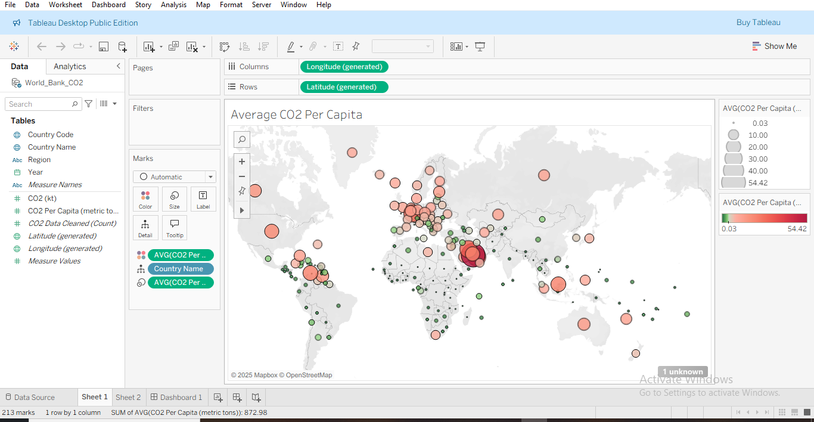
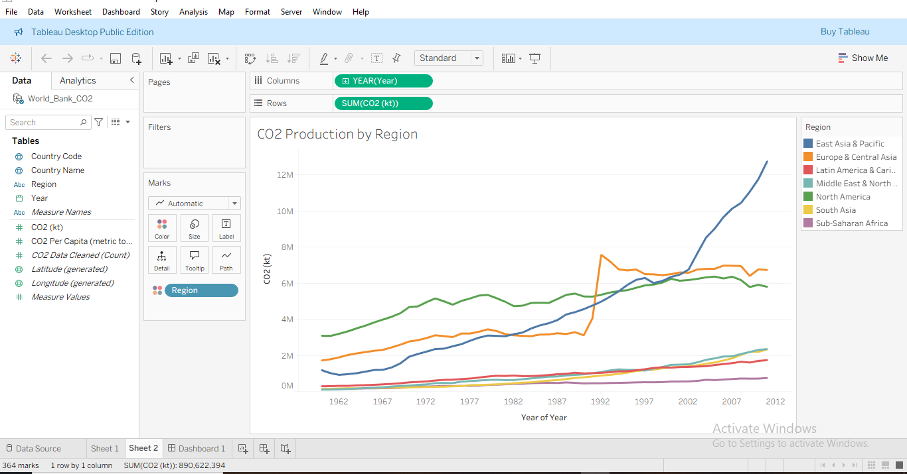
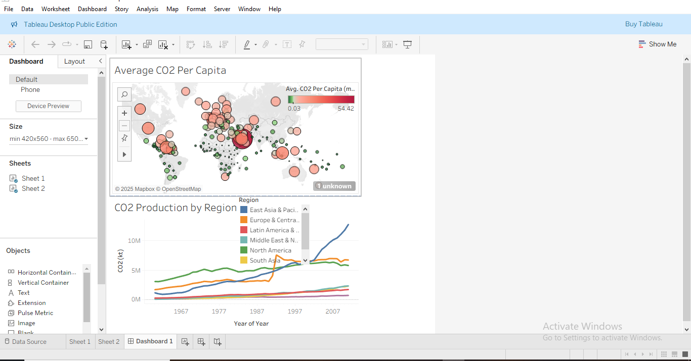

# 🌍 Global CO₂ Emissions Analysis (1960–2011)

**Objective:** To explore global CO₂ emissions over time using World Bank data, with a focus on both **per capita emissions (by country)** and **total production (by region)** to identify sustainability challenges and opportunities.

**Tools:** Tableau, Excel  
**Skills showcased:** Data integration, trend analysis, geospatial visualization, dashboard storytelling

---

## 📊 Visualizations

**CO₂ Per Capita by Country (2000–2011)**  

**Total CO₂ Production by Region (1960–2011)**  

**Dashboard Overview**  

👉 [View Interactive Dashboard on Tableau Public](https://public.tableau.com/views/DashboardsStarterTemplate_17570045049280/Dashboard1?:language=en-GB&:sid=&:redirect=auth&:display_count=n&:origin=viz_share_link)

---
## What I built
- **Map visualization** of average CO₂ emissions per capita by country (2000–2011).  
- **Time-series visualization** of total CO₂ emissions by world region (1960–2011).  
- Dashboards combining country-level and regional-level insights for policymakers and researchers.

---

## Key takeaways
- Global CO₂ emissions are highly uneven across regions and countries.  
- East Asia & Pacific has emerged as the **leading contributor** in recent decades.  
- North America remains a **high emitter**, while Europe shows signs of **declining emissions**.  
- Sustainability requires **global cooperation** — developed economies must lead on clean energy, while emerging economies must balance growth with sustainability.  

---

## Key insights
1. **Economic development drives emissions** — industrial growth correlates with sharp increases.  
2. **Emissions are unevenly distributed** — some regions contribute disproportionately while others remain low.  
3. **Policy & business action are critical** — balancing growth with sustainability will define future emissions pathways.  

---

## Files
- `/tableau/CO2_dashboard.twbx` — Tableau workbook (publish to Tableau Public recommended)  
- `/data/World_Bank_CO2.xlsx` — processed World Bank data (CO₂, population, GDP, etc.)  
- `/assets/CO2_sheet1_map.png` — CO₂ per capita map preview  
- `/assets/CO2_sheet2_trends.png` — regional CO₂ production trends  

---

## How to view
1. Open `/assets/` images for quick highlights.  
2. Use the Tableau Public link (if included) for the interactive dashboard.  
3. Download and open `.twbx` in Tableau Desktop/Public to explore locally.  

---

## License
MIT © Oluwatosin Olaniyan

